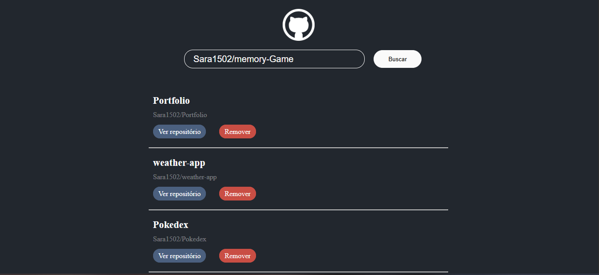

# Wiki de repositórios do github

## Funcionalidades:
- Utiliza a API do github para pergar as informações dos repositórios;
- Botão de "ver repositório" que abri uma nova guia na página do repositório;
- Botão de "remover" que remove o repositório da lista.
